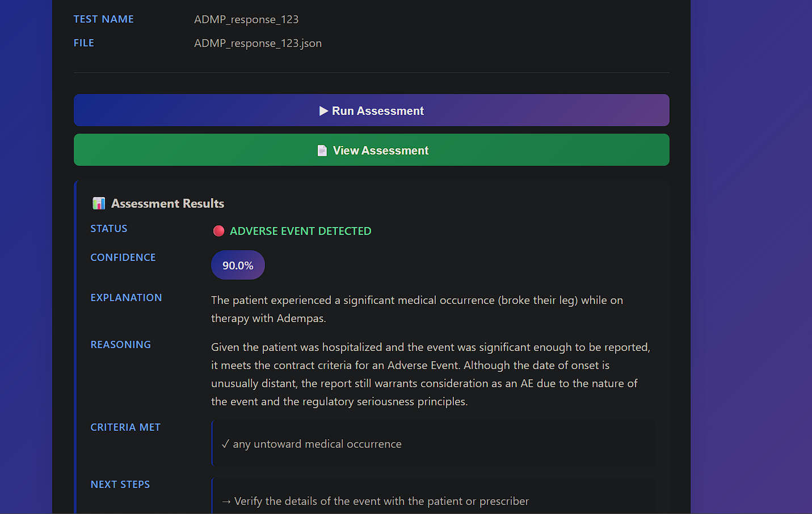
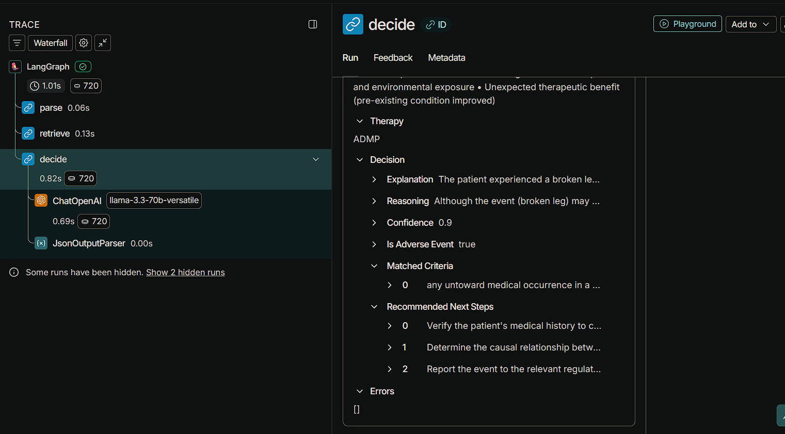
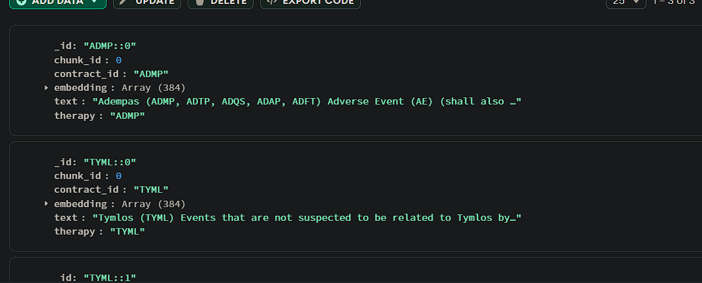

# Clinical Adverse Event Detection AI

## Overview

This project helps healthcare teams identify and understand adverse events in clinical data. It combines advanced analytics with clear explanations, making it easier to improve patient safety and meet compliance requirements. The system is modular and easy to extend or integrate with other tools.

## Key Features

- **Adverse Event Detection:** Finds potential adverse events in clinical data using modern analytics.
- **Clear Explanations:** Gives straightforward reasons and context for each event flagged.
- **Flexible Data Ingestion:** Handles both structured and unstructured healthcare data.
- **Retrieval-Augmented Generation (RAG):** Combines data retrieval and generative models for better decision support.
- **Modular Design:** Built for easy updates, maintenance, and integration.

## Project Structure

The repository is organized at the top level. Each main folder has its own README with more details:

```
clinical-adverse-event-detection-ai/
│
└── backend/
    ├── agent/      # Assessment intake, contract validation, adverse event detection
    └── ingestion/  # Data ingestion and vector embedding
```

### Folder Overview

- **backend/agent/**: Handles assessment intake, contract validation, and adverse event detection. Includes the API server, models, and test outputs. Use `.env` files for environment variables and `requirements.txt` for dependencies.
- **backend/ingestion/**: Manages data ingestion and creates vector embeddings for analysis. Contains scripts, utilities, and its own environment setup.

Test outputs and sample data are in the `test/outputs/` and `test/data/` folders of each backend module.

See each folder's README for setup and usage instructions.

## System Workflow

1. **Data Ingestion:** Clinical data (structured and unstructured) is ingested and preprocessed using robust pipelines.
2. **Data Storage:** Processed data is stored in a secure database (e.g., MongoDB) for downstream analysis.
3. **AI/ML Processing:** Advanced models analyze the data to detect adverse events and generate detailed, explainable outputs.
4. **API Serving:** Results and explanations are served via a RESTful API for integration with external systems.
5. **Explainability:** Every detection is accompanied by transparent reasoning to support clinical decision-making and compliance.

## Getting Started

### Prerequisites

- Python 3.8 or higher
- MongoDB (Atlas or local instance)
- Virtual environment tool (venv or conda)
- For Azure services: Azure OpenAI credentials or OAuth configuration
- For HuggingFace: Internet access to download models
- Docker (optional, for containerized deployment)

### Quick Start (Full Stack)

#### 1. Clone and Navigate

```bash
git clone <repository-url>
cd clinical-adverse-event-detection-ai
```

#### 2. Backend Setup

**Option A: Agent Service (Detection API)**

```bash
cd backend/agent

# Create and activate virtual environment
python -m venv .venv
source .venv/bin/activate  # macOS/Linux
# OR
.venv\Scripts\Activate.ps1  # Windows PowerShell

# Install dependencies and models
pip install -r requirements.txt
python -m spacy download en_core_web_lg

# Configure environment
cp .env.example .env
# Edit .env with your settings (API keys, model choices, etc.)

# Run the server
uvicorn src.app.server:app --host 0.0.0.0 --port 8080 --reload
```

Visit: http://localhost:8080/docs for interactive API documentation.

**Option B: Ingestion Service (Data Preprocessing)**

```bash
cd backend/ingestion

# Create and activate virtual environment
python -m venv .venv
source .venv/bin/activate  # macOS/Linux

# Install dependencies
pip install -r requirements.txt

# Configure environment
export ENVIRONMENT=dev
export EMBEDDINGS_PROVIDER=huggingface
# OR set other env vars as needed

# Run ingestion
python -m src.app.run
```

### Configuration

See detailed environment configuration in:

- [backend/agent/README.md](backend/agent/README.md#environment-configuration) - LLM and embedding providers
- [backend/ingestion/README.md](backend/ingestion/README.md#key-environment-variables) - Chunking and database options

### Docker Deployment

For containerized setup:

```bash
cd backend/agent
docker build -t clinical-ae-agent:latest .
docker run --rm -p 8080:8080 --env-file .env clinical-ae-agent:latest
```

See [backend/agent/README.md](backend/agent/README.md#running-with-docker) for GPU support and advanced options.

## System in Action

### Assessment Evaluation & Results

The agent processes clinical assessments and returns detailed, explainable decisions:



_Assessment results showing adverse event detection (90% confidence) with explanation, reasoning, and recommended next steps_

### Observability & Tracing

Full visibility into decision-making with LangSmith integration:



_LangGraph execution trace showing parse, retrieve, and decide components with model performance metrics_

### Data Storage & Retrieval

Contract data is chunked and embedded for efficient retrieval:



_Contract chunks stored in MongoDB with embeddings for RAG-based retrieval_

## Example Workflow

### Assessment Input (Summary)

An assessment is submitted as a FHIR QuestionnaireResponse, including:

- Patient, medication, and reporter information
- Answers to clinical questions (e.g., drug stopped, AE description, hospitalization, resolution)
- Status, dates, and identifiers

Example structure:

```json
{
  "id": "...",
  "resourceType": "QuestionnaireResponse",
  "status": "completed",
  "item": [
    { "linkId": "MEDICATION", "answer": [{ "valueString": "Adempas" }] },
    {
      "linkId": "ADEPTCOMPLAINT",
      "answer": [{ "valueString": "Broke their leg skiing" }]
    },
    {
      "linkId": "HOSPITALIZATION",
      "answer": [{ "valueCoding": { "code": "yes" } }]
    }
    // ...other clinical questions...
  ]
}
```

### Agent Output (Summary)

After processing, the agent returns a decision object with:

- Whether an adverse event was detected
- Matched criteria and contract context
- Explanation and reasoning
- Recommended next steps
- Confidence score

Example structure:

```json
{
  "therapy": "ADMP",
  "decision": {
    "is_adverse_event": true,
    "matched_criteria": ["Adverse Event", "Seriousness: hospitalization"],
    "explanation": "...",
    "reasoning": "...",
    "recommended_next_steps": [
      "Report as serious AE",
      "Obtain follow-up details",
      "Verify dates"
    ],
    "confidence": 0.86
  },
  "contract_context_preview": "...contract excerpt..."
}
```

### Backend

1. Navigate to `backend/agent` and install dependencies:
   ```sh
   pip install -r requirements.txt
   ```
2. Start the API server:
   ```sh
   uvicorn src.app.server:app --reload
   ```

### Ingestion

1. Use scripts in `backend/ingestion` to ingest and preprocess clinical data as required by your use case.

## Requirements

- Python 3.8 or higher
- See `backend/agent/requirements.txt` and `backend/ingestion/requirements.txt` for a full list of dependencies.
